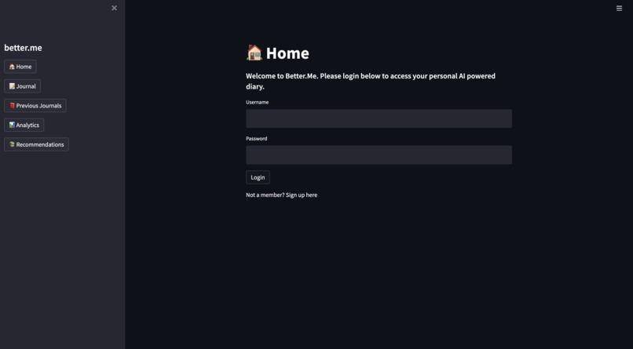
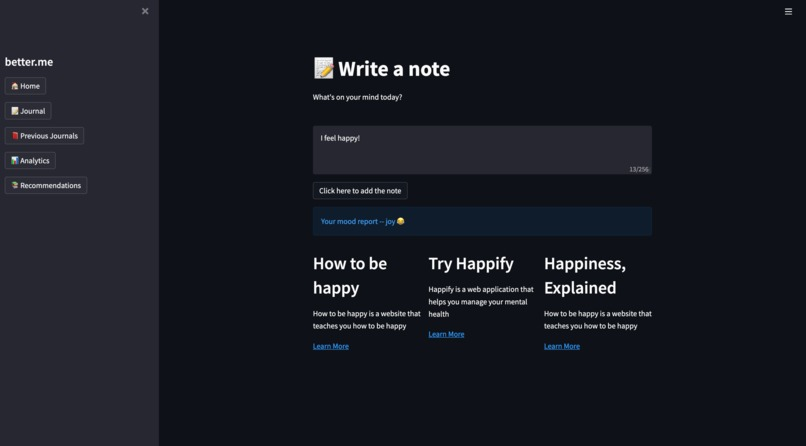
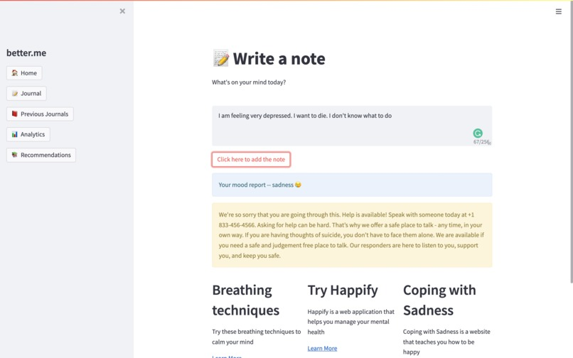
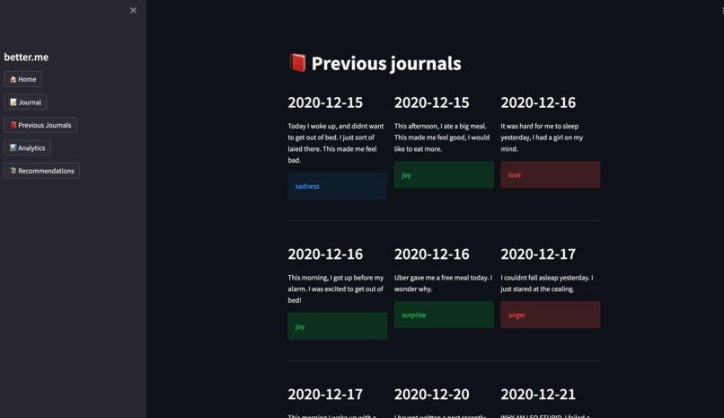
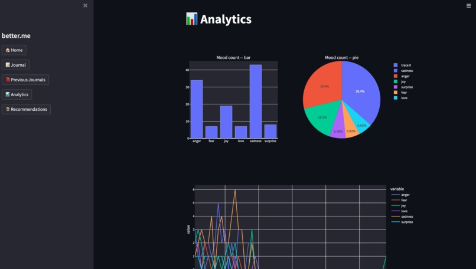
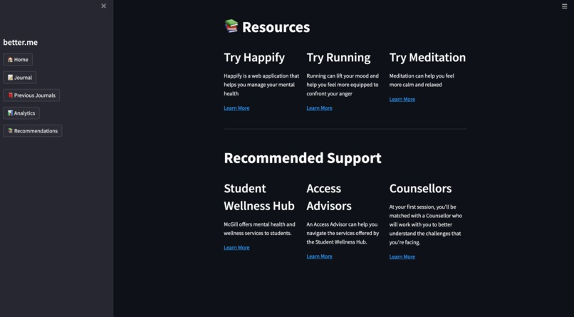

# better.me, AI Journaling

<!-- Demo pictures at the end of the document. -->
<!-- Check out the deployed app on GCP App Engine from [here](https://betterme-journal.uc.r.appspot.com/)! -->
Check out the project details from [Devpost](https://devpost.com/software/better-me-5w3lpj?ref_content=user-portfolio&ref_feature=in_progress)!

## Project Description
better.me is an AI journaling tool that helps you analyze your emotions and provide you with smart recommendations for your well being. We used NLP emotion analytics to process text data and incorporated a suicidal prevention algorithm that will help you make better informed decisions about your mental health.  

## Motivation
Poor mental health is a growing pandemic that is still being stigmatized. Even after spending $5 Billion in federal investments for mental health, 1.3 million adults attempted suicide and 1.1 million plans to commit suicide. 

> Our mission is to provide a private environment to help people analyze their emotions and receive mental health support.

## MVP Product Features Overview

| Features              | Description                                                                                                                                               |
| --------------------- | --------------------------------------------------------------------------------------------------------------------------------------------------------- |
| Personal Journal      | Better Me is a personal AI-powered journal where users can write daily notes reflecting on their life's progress.                                         |
| NLP Emotion Analytics | With the help of natural language process, Better Me will classify the user's emotional situation and keep a track of the data.                           |
| Smart Recommendations | It uses this monitored data to suggest appropriate mental health resources to the users and also provides them with suitable data analytics.              |
| Suicide Prevention    | In order to take a step forward towards suicide prevention, it also incorporates a suicidal text detection algorithm that triggers a preventive measure . | 

## How we built it

We used Google T5 NLP model for emotional recognition and categorizing emotions. We trained data set with deep learning to develop a fine tuned BERT model to prevent suicide. We also implemented our own algorithm to make resource recommendations to users based on their emotional changes, and also did some data analytics. Due to time restraints and a member's absence, we had to change from React.js plus Firebase stack to Streamlit, a python library design framework.

## Challenges 
Initially, we tried creating a dashboard using full-stack web development, however, it proved to be quite a challenging task with the little amount of time we had. We decided to shift our focus to quickly prototyping using a lightweight tool, and streamlit was the ideal choice for our needs. While deploying our suicide prevention algorithm on Google Cloud Function, we had trouble deploying due to memory availability constraints.

## Accomplishments
We are proud that we came up with such a novel idea that could be useful to innumerable people suffering from mental health issues, or those who are like to stay reserved with themselves or in a confused state about their mental well-being, just by writing about their daily lives. We are also proud of incorporating a suicide prevention algorithm, which could be life-saving for many.

## Roadmap

| Future Implementations                | Descriptions                                                                               |
| ------------------------------ | ------------------------------------------------------------------------------ |
| Firebase Back End Architecture | We hope to design a scalable backend which accommodates for the users needs.   |
| AI Mental Health Chat bot      | Provide on the spot, mental health support using Dialogflow AI chat bot.       |
| Connect with Therapists        | Elevate data analytical features to connect and report to personal therapists. |
| Scaling Up                     | Fund our project and develop this project with scalable front and back end.    |
| Languages Support              | Support multiple languages, including French, Mandarin, and Spanish.           |

## Demo Picture

